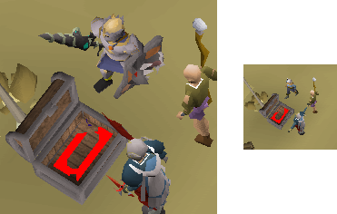
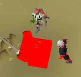
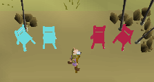
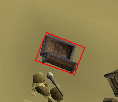

### About TRSObjectFinder

---
#### TRSObjectFinder.Zoom

This field contains the zoom level that this finder was created at. 
This allows the object finder to work at any zoom level without needing to change variables.

A finder working at two different zoom levels, producing similar results:



---

#### TRSObjectFinder.Colors

A color array which will be merged together, use ACA to acquire color(s).

```pascal
Finder.Colors += CTS2(2503237, 20, 0.10, 0.14); // brown
Finder.Colors += CTS2(5526875, 15, 0.19, 0.06); // grey
```

The two colors above found and merged together:



---

#### TRSObjectFinder.ColorClusters

A array of "color clusters" which will be merged together, use ACA to acquire color(s).

A color cluster consists of a `primary` and `secondary` color and a `distance` value.
When searched for only `primary` colors within `distance` of `secondary` colors are returned.

```pascal
// Only brown within 2 pixels of grey will be found.
Finder.ColorClusters += [
  CTS2(2503237, 20, 0.10, 0.14), // brown
  CTS2(5526875, 15, 0.19, 0.06), // grey
  2				 // distance			
];                        
```

The above color cluster found:


---

#### TRSObjectFinder.Erode

The amount to erode before clustering. This is useful for removing small amounts of noise.

```pascal
Finder.Erode := 2;
```

`Erode=0`


`Erode=2`


---

#### TRSObjectFinder.Grow

The amount to grow before eroding. This is useful for filling gaps.

```pascal
Finder.Grow := 2;
```

`Grow=0`


`Grow=3`


Paired with eroding:
`Grow=3`
`Erode=4`


---

#### TRSObjectFinder.ClusterDistance

The distance to pass to `ClusterTPA`, this is how we split up multiple objects. `Distance=5` would mean that points that are closer than or equal to 5 pixels away are considered close enough to merge into a singular group.

`ClusterDistance=5` Four individual chairs:


`ClusterDistance=20` Two sets of chairs:



---

#### Filtering By Size 

```pascal
TRSObjectFinder.MinLongSide 
TRSObjectFinder.MaxLongSide 
TRSObjectFinder.MinShortSide 
TRSObjectFinder.MaxShortSide
```

These are the size limits that can be set, any object that exceeds these will be removed. The bounding rectangle is found which has a `long` and a `short` side measured in pixels.

```pascal
// Removes objects where the short side isn't within `10..20`
Finder.MinShortSide := 10;
Finder.MaxShortSide := 20;
// Removes objects where the long side isn't within `20..40`
Finder.MinLongSide := 20;
Finder.MaxLongSide := 40; 
```

An example bounding rectangle: 

